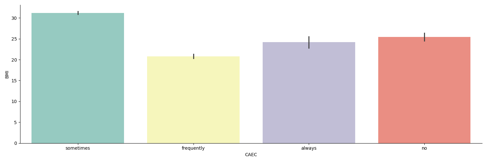

# Laporan Proyek Machine Learning: Analisa Data Obesitas 
# Nama : Muhammad Faishal Ali D.

## A. Domain Proyek
### 1. Penjelasan Umum
Masalah gizi merupakan hal yang sangat kompleks dan serius. Karena menyangkut kualitas penerus-penerus bangsa. Seperti halnya di Indonesia. Salah satu masalah gizi yang masih menjadi pembahasan hangat adalah obesitas.

Obesitas merupakan suatu kondisi medis yang ditandai oleh penimbunan lemak tubuh berlebihan, yang dapat meningkatkan risiko terjadinya berbagai penyakit kronis. Faktor-faktor seperti pola makan yang tidak sehat, gaya hidup yang kurang aktif, dan perubahan budaya telah berkontribusi pada meningkatnya angka obesitas di seluruh dunia.

Menurut data Organisasi Kesehatan Dunia (WHO), obesitas telah mencapai tingkat epidemiologi, dengan lebih dari 650 juta orang dewasa di seluruh dunia dinyatakan obesitas pada tahun 2016. Hal ini menunjukkan bahwa obesitas bukan lagi hanya masalah kesehatan individu, tetapi juga menjadi beban kesehatan masyarakat yang signifikan. Obesitas dapat timbul disebabkan oleh beberapa hal sebagai berikut:

1. Kurangnya aktifitas fisik baik kegiatan harian maupun latihan fisik terstruktur
2. keturunan genetika
3. Faktor lingkungan

### 2. Sebab Akibat Masalah
Hal ini perlu dilakukan analisis serta penanggulangan lebih lanjut, sebab obesitas dapat meningkatkan risiko terjadinya penyakit-penyakit kardiovaskular, diabetes tipe 2, dan tekanan darah tinggi. Selain itu, biaya kesehatan yang terkait dengan pengobatan dan manajemen obesitas memberikan tekanan tambahan pada sistem kesehatan nasional.

Maka dari itu, perlu melakukan berbagai strategi untuk mengurangi resiko masyarakat terkena obesitas. Seperti anjuran mengkonsumsi makanan sehat, olahraga, serta pengadaan infrastruktur ideal untuk peninjauan status tubuh.

Disini saya berinisiatif untuk melakukan analisis lebih lanjut mengenai data masyarakat beserta label yang menunjukkan apakah sedang mengalami obesitas atau tidak. Serta memberikan informasi pada kondisi ciri-ciri tubuh agar lebih berhati-hati dalam melakukan kebiasaan hidup.

### 3. Referensi
   1. [Referensi Pertama](https://d1wqtxts1xzle7.cloudfront.net/39625453/jurnal-libre.pdf?1446519911=&response-content-disposition=inline%3B+filename%3DFAKTOR_RISIKO_OBESITAS_PADA_ANAK_5_15_TA.pdf&Expires=1706423938&Signature=CfseHwMvVXjfNg90XPlccC~RocUVem5IncpL82cJPnYcPEL9rRJgkjy3eA5AFzVMKtvSfxJfO~WGhARcxrvmn3MGkw6Eslf5UwFnNZFL5zqd7UamxeWU0mZ2qS0SAH~kcO7cF4DDHQQADyGNDPTLRRlxdL0-cpA35~ZzhmjrPqxNmbFkCKNKFz4YCsUBc4v~Hffnyl2ZjMkcR1MkJ~XBr8kJKCnQS~OaFeWkjetvIkn4FR-OBOJEXffkgmohYc~-09NT0WjluDqHP3Dx-Dt1-bhGIqowCqQEUGgfl6pvdA6O2BK-ZiNJvI~sDgZVKukUQdQpFvJgz7PDPFqNHVEQ9w__&Key-Pair-Id=APKAJLOHF5GGSLRBV4ZA)
   2. [Referensi Kedua](https://pgm.persagi.org/index.php/pgm/article/view/47)
   3. [Referensi Ketiga](https://journals.telkomuniversity.ac.id/jett/article/download/1395/1005/)
   

## B. Business Understanding
Pada proses analisis ini, saya berfokus untuk mengambil permasalahan-permasalahan yang akan diangkat dari permasalahan garis besar untuk mencari solusi yang tepat. Berikut adalah uraiannya:

### 1. Problem Statements
1. Bagaimana cara untuk mengurangi potensi masyarakat terkena obesitas?
> Mengangkat masalah pada potensi masyarakat terkena obesitas, seperti pola hidup, dan makanan yang dikonsumsi.
1. Dari segi aspek apa saja tubuh dapat dikatakan tidak obesitas?
> Mencari aspek yang dapat dianalisis seperti berat badan, BMI, kecukupan kalori pada makanan, dan lain-lain. Membuktikan bahwa parameter-parameter ini yang dapat menjadi acuan seseorang mengidap obesitas atau tidak dengan penghitungan BMI secara resmi.

### 2. Goals
1. Memberikan insight pada data mengenai kriteria penderita obesitas.
> Memberikan informasi terhadap data orang yang terkena obesitas maupun tidak. Berdasarkan ukuran badan seperti tinggi badan, berat badan, dan BMI.
2. Memberikan gambaran umum pada ciri-ciri tubuh yang sehat.
> Memberikan informasi terkait ciri-ciri tubuh yang sehat dan tidak terindikasi obesitas.

### 3. Solution Statements
1. Membuat analisis data dengan visualisasi data yang menggambarkan kondisi data untuk prediksi pada tahap modelling.
2. Membuat model regresi pada data obesitas menggunakan **Random Forest** dengan kolom BMI sebagai target.
3. Melakukan hyperparameter tuning pada *n_estimator*, *random_state*, *n_jobs*, dan *max_depth* untuk mengoptimalisasi kinerja model. 
4. Menggunakan metrik evaluasi *Mean Squared Root* (MSE)

## C. Data Understanding
Pada bagian ini akan memberikan penjelasan terkait data yang digunakan untuk analisis. Berikut detailnya:

### 1. Informasi Data
      Data yang digunakan pada proses analisis ini merupakan data sumber-terbuka (open source) yang memuat tentang informasi gaya hidup penduduk di Mexico, Peru, dan Colombia. Data ini dikumpulkan oleh **ScienceDirect** dibawah lisesn Creative Commons. Data asli sudah cukup bersih, hanya perlu dilakukan beberapa langkah pembersihan.

      Untuk jumlah data awal sebelum analisis lebih lanjut adalah **2111 baris** dan **19 kolom fitur** hasil dari pengambilan sumber dari tautan dan menggunakan perintah

```py
obesDf.shape
```

Perintah di atas memanggil variabel dataframe yang memuat dataset, dilanjutkan dengan fungsi yang menampilkan bentuk data berdasarkan baris dan kolom.

### 2. Tautan Sumber Data
Berikut adalah link yang mengarah pada sumber tautan

[LINK DATASET](https://www.kaggle.com/datasets/mandysia/obesity-dataset-cleaned-and-data-sinthetic)

### 3. Uraian Fitur di Dalam Data
Di dalam dataset itu sendiri, terdapat banyak fitur yang ada dan dapat dilakukan analisis. Berikut adalah uraiannya:

| No. | Nama Kolom | Deskripsi |
|:--:|:-:|:-|
| 1. | Id | Kolom index pada setiap baris data |
| 2. | BMI | Indeks masa tubuh ideal |
| 3. | Gender | Jenis Kelamin target yang diobservasi  |
| 4. | Age | Usia target yang diobservasi  |
| 5. | Height | Tinggi badan dalam satuan *inch* target yang diobservasi |
| 6. | Weight | Tinggi badan dalam satuan *inch* target yang diobservasi |
| 7. | family_history_with_overweight | Riwayat keluarga dengan berat badan berlebih (obesitas) |
| 8. | FAVC | Frekuensi mengkonsumsi makanan tinggi kalori target yang diobservasi |
| 9. | FCVC | Frekuensi mengkonsumsi sayur-mayur target yang diobservasi |
| 10. | NCP | Jumlah makan pokok perhari target yang diobservasi |
| 11. | CAEC | Frekuensi makan cemilan target yang diobservasi |
| 12. | SMOKE | Kebiasaan merokok target yang diobservasi |
| 13. | CH2O | Jumlah minum air target yang diobservasi |
| 14. | SCC | Kebiasaan monitoring konsumsi kalori target yang diobservasi |
| 15. | FAF | Frekuensi kegiatan fisik target yang diobservasi |
| 16. | TUE | Waktu penggunaan perangkat dalam satuan *jam* target yang diobservasi |
| 17. | CALC | Frekuensi mengkonsumsi alkohol target yang diobservasi |
| 18. | MTRANS | Kategori transportasi yang digunakan target yang diobservasi |
| 19. | NObeyesdad | Kategori berat badan |


Untuk fitur target ada di fitur **BMI** dengan perhitungan fitur **Height** dan **Weight**

### 4. Penjelasan Tahapan-tahapan Data Understanding
Pada prosesnya, data understanding terbagi menjadi beberapa tahapan. Berikut detailnya:

A. Data Loading

Pada proses ini, dilakukan proses pemuatan data ke dalam *workspace* yang digunakan, pada kasus ini adalah *notebook*. Perintah yang ditulis adalah
```py
obesDfPath = 'data/ObesityDataSet_cleaned_and_data_sinthetic.csv'
obesDf = pd.read_csv(obesDfPath)
```

Path yang ditulis disesuaikan dengan direktori yang digunakan. Pada analisis ini, data diletakkan pada perangkat lokal pengguna dengan menggunakan *Jupyter Notebook*.

B. Data Assessing 

Pada proses ini, dilakukan penilaian pada kelayakan data. Hal ini meliputi berbagai aspek tinjauan. Berikut adalah detailnya:

1. Penilaian Dataset Awal

      Pada tahap ini, yang dilakukan adalah melihat informasi keseluruhan dari dataset. Berikut kodenya:
      ```py
      obesDf.info()
      ```

      Dari hasil perintah di atas, akan menampilkan poin-poin seperti nama kolom yang ada, jumlah data dari setiap kolom, tipe data kolom, dan lain-lain.

      Hasilnya adalah terdapat **2111** data tidak null pada setiap kolom. Dengan karakteristik kolom sebagai berikut:

      | Tipe Data Kolom | Jumlah Kolom |
      |:----------:|:----------:|
      | Object |    14    |
      | Integer |    3    |
      | Float |    2    |

2. Pengecekan Data Null
      
      Pada tahap ini, dilakukan peninjauan terhadap nilai-nilai baris yang ada di setiap kolomnya. Tujuannya adalah untuk melihat banyak nilai null disetiap kolomnya. Berikut adalah kodenya:

      ```py
      obesDf.isna().sum()
      ```

      Dari hasil kode di atas, tidak ditemukan nilai null dari keseluruhan kolom.

3. Pengecekan Data Duplikat
      
      Pada tahap ini, dilakukan peninjauan pada nilai-nilai yang terduplikasi secara *unique*. Tujuannya adalah untuk mengurangi distorsi pada data akibat adanya data duplikat. Berikut kodenya:

      ```py
      obesDf.duplicated().sum()
      ```

      Dari hasil kode di atas, tidak ditemukan nilai duplikat dari keseluruhan kolom.

4. Deskripsi Nilai Statistik Dataset

      Pada tahap ini, dilakukan identifikasi awal nilai-nilai statistik pada kolom numerik yang ada di dataset. Berikut Kodenya:

      ```py
      obesDf.describe()
      ```

      Untuk hasil dari kode di atas adalah sebagai berikut:
      |  | Age | Height | Weight | NCP | BMI |
      |:-|:-:|:-:|:-:|:-:|:-:|
      | count | 2111 | 2111 | 2111 | 2111 | 2111 |
      | mean  | 24.315964  | 1.701677 | 86.588820 | 2.687826 | 29.700159 |
      | std   | 6.357078  | 0.093305 | 26.188572 | 0.809680 | 8.011337 |
      | min   | 14.000000  | 1.450000 | 39.000000 | 1.000000 | 12.998685 |
      | 25%   | 20.000000  | 1.630000 | 65.500000 | 3.000000 | 24.325802 |
      | 50%   | 23.000000 | 1.700499 | 83.000000 | 3.000000 | 28.719089 |
      | 75%   | 26.000000 | 1.768464 | 107.000000 | 3.000000 | 36.016501 |
      | max   | 61.000000 | 1.980000 | 173.000000 | 4.000000 | 50.811753 |

      Dari hasil di atas, terindikasi ada tipe data kolom yang masih kurang tepat, yaitu pada kolom **Weight**.

C. Data Cleaning
      
Setelah dilakukan Data Assesing, yang dapat dilakukan pembersihan hanya pada penggantian tipe data kolom Weight. Berikut kodenya:

```py
obesDf['Weight'] = obesDf.Weight.astype(float)
```

D. Exploratory Data Analysis (EDA)

Pada proses ini, terdapat beberapa langkah yang dilakukan. Tujuannya adalah memudahkan untuk mengenali dataset dengan pengelompokan dan penyajian secara visual. Berikut adalah detailnya:

1. Menghapus Kolom yang Tidak Perlu
   
   Tahap ini bertujuan agar dimensi data tidak terlalu besar, dengan begitu pemuatan data tidak akan terlalu lama dan berat. Berikut adalah kodenya:

   ```py
   obesDf = obesDf[['Height', 'Weight', 'BMI', 'CAEC', 'NObeyesdad']]
   ```

   Dari hasil kode di atas, saat ini dataframe hanya terdiri dari 5 kolom yaitu:
      - Height
      - Weight
      - BMI
      - CAEC
      - NObeyesdad
  
2. Pencarian Missing Value Lanjutan
   
      Pada pencarian missing value mendalam, dilakukan penelusuran pada setiap kolom numerik dengan pencarian input nilai pada nilai yang kemungkinan formatnya salah.

      Pada setiap kolom numerik, penanganannya sama yaitu mengantisipasi tidak adanya nilai kurang dari atau sama dengan 0. Sebab, nilai 0 ke bawah tidak mungkin ada pada ukuran berat badan dan tinggi badan.

      - Kolom Height

        ```py
        heightZero = (obesDf.Height <= 0).sum()
        ```

        hasilnya:
        > 0
      - Kolom Weight

        ```py
        weightZero = (obesDf.Weight <= 0).sum()
        ```
        
        Hasilnya:
        > 0

      - Kolom BMI

        ```py
        zeroBMI = (obesDf.BMI <= 0).sum()
        ```

        Hasilnya:
        > 0

      Dari hasil proses di atas, dapat disimpulkan bahwa kolom numerik sudah bersih dari missing value.

3. Pencarian Nilai *Outliers*
   
   Pada proses ini, terdapat beberapa langkah untuk mengidentifikasi nilai outliers pada setiap kolom numerik yang akan digunakan untuk fitur-fitur modelling. Sebab, jika tidak dibersihkan akan memberikan kualitas data dan model yang tidak maksimal.

   Pada langkah-langkah di bawah, dilakukan visualisasi data menggunakan boxplot. Jenis plot ini sangat umum digunakan untuk mencari nilai outliers dari titik-titik persebaran data. Berikut adalah hasilnya:

   - Kolom Height
      
   - Kolom Weight
      
   - Kolom BMI
      

   Dari hasil di atas, terdapat outliers pada kolom **Height** dan **Weight**. Maka selanjutnya adalah menangani data tersebut menggunakan metode **IQR (Inter Quartile Range)**.

4. Penanganan Outlier
   
      Pada proses ini, dilakukan identifikasi dan eliminasi nilai-nilai outlier yang ada di dalam fitur-fitur yang akan digunakan dalam modeling. Terdapat banyak cara atau rumus dalam mengeliminasinya. Namun, disini akan menggunakan metode IQR atau *Inter Quartile Range*. 
      
      Rumus:

      IQR = Q3 - Q1

      Penjelasan:

      Q1 = Kuartil pertama dari data (25%)

      Q3 = Kuartil ketiga dari data (75%)

      IQR = Inter Quartile Range

      Kode:

      **Pengambilan Kuartil**
      ```py
      q1 = numerical.quantile(0.25)
      q3 = numerical.quantile(0.75)
      iqr = q3 - q1
      ```

      Setelah mendapatkan nilai IQR-nya, maka selanjutnya adalah mencari batas atas dan batas bawahnya.

      **Pencarian Batas Atas dan Bawah**
      ```py
      upper = q3 + 1.5 * iqr
      bottom = q1 - 1.5 * iqr
      ```

      Dapat diketahui bahwa outlier selalu berada di bawah atau di atas batas-batas tersebut. Selanjutnya adalah menghapus nilai outliers yang terjaring pada kondisi ini. 

      **Penyaringan Data**
      ```py
      outliers = ((numerical < bottom) | (numerical > upper))
      ```

      Setelah data outlier didapatkan, maka dapat dihapus

      **Penghapusan Data Outlier**
      ```py
      cleanedObesDf = obesDf[~outliers.any(axis=1)]
      ```

5. Pencarian Nilai *Outliers* Lanjut
   
   Setelah itu dilakukan pengecekan dengan menggunakan box plot lanjut
   - Kolom Height
      
   - Kolom Weight
      
   - Kolom BMI
      
   
   Dari hasil penghapusan outlier sebelumnya, ternyata masih terdapat data outlier di dalam kolom **Height**. Dan juga, dapat terlihat bahwa nilai outlier merupakan nilai maksimal. 
   
   Maka yang perlu dilakukan adalah mengeksekusi ulang kode-kode penghapusan data outlier (seperti pada langkah sebelumnya)

6. Univariate Analysis
   
   Pada tahap ini, fokusnya adalah mencari pola data dari setiap kolomnya. Dalam pengolahan dan ekstraksi isinya, dibagi menjadi:

      1. Kolom Kategorikal
   
         Pada kolom kategorikal, fokusnya adalah mencari presentase jumlah pada nilai unique.
         
         Terdapat formula umum yang digunakan adalah sebagai berikut:

         ```py
            count = cleanedObesDf[feature].value_counts()
            percent = 100 * cleanedObesDf[feature].value_counts(normalize=True)   

            df = pd.DataFrame({
            'Jumlah sampel':count, 
            'Persentase':percent.round(1)
            })
            print(df)
         ```

            Hasilnya adalah sebagai berikut:
            - Kolom FAVC

            | CAEC | Jumlah Sampel | Presentase
            |:--|:--:|:--:|
            | sometimes | 1764 | 83.7% | 
            | frequently | 241 | 11.4% | 
            | always | 52 | 2.5% | 
            | no | 51 | 2.4% |

            Dengan hasil visualisasi data sebagai berikut:

            
            - Kolom Kategori Berat Badan (NObeyesdad)

            | NObeyesdad | Jumlah Sampel | Presentase
            |:--|:--:|:--:|
            | obesity_type_i | 349 | 16.6% | 
            | obesity_type_iii  | 323 | 15.3% | 
            | obesity_type_ii | 297 | 14.1% | 
            | overweight_level_i  | 290 | 13.8% |
            | overweight_level_ii  | 290 | 13.8% |
            | normal_weight  | 287 | 13.6% |
            | insufficient_weight  | 272 | 12.9% |

            Dengan hasil visualisasi data sebagai berikut:

            

      2. Kolom Numerik

         Pada kolom-kolom numerik, fokusnya yaitu melihat pola persebaran data. Berikut detailnya:

            
         1. Kolom BMI
            - Pada kolom BMI (Kolom Target) persebaran banyak data cenderung rata. Dengan perolehan banyak data terbanyak ada di kisaran BMI 27 dan 18.
            - Banyak BMI terendah ada di angka 50 dengan total hampir 0 data.
            - Kemiringan data cenderung ke kanan (Right-Skewed), tetapi masih dapat dikatakan hampir simetris.
         2. Kolom Height
            - Data cenderung simetris.
            - Banyak data terbanyak ada di kisaran angka 1.7-1.8
         3. Kolom Weight
            - Kemiringan data cenderung ke kanan (Right-Skewed)
            - Banyak data terbanyak ada di angka 80
            - Banyak data terendah ada di kisaran angka 140 - 160

7. Multivariate Analysis

   Pada proses ini, tujuannya adalah mencari relasi pola pada dua atau lebih kolom untuk menyimpulkan keterkaitan antar kolom-kolom itu. Berikut detailnya:

   1. Kolom Kategorikal
      Pada kolom kategorikal, plotting dilakukan pada satu kolom ke kolom target.
      1. Kolom CAEC
            

            - Rata-rata BMI bervariasi, dengan frekuensi memakan cemilan kategori "sometimes" memiliki rata-rata tertinggi
            - Frekuensi memakan cemilan kategori "frequently" memiliki rata-rata terendah
            - Dapat diasumsikan bahwa fitur CAEC memiliki pengaruh relatif rendah terhadap fitur BMI

      2. Kolom NObeyesdad
            

            - Rata-rata BMI bervariasi, dengan kategori "obesity_type_iii" memiliki rata-rata tertinggi
            - Kategori "insufficient_weight" memiliki rata-rata terendah
            - Dapat diasumsikan bahwa fitur NObeyesdad memiliki pengaruh relatif tinggi terhadap fitur BMi, sebab fitur ini merepresentasikan langsung data BMI yang dikonversikan dalam bentuk kategorikal

   2. Kolom Numerik
      Pada kolom numerik akan dilakukan beberapa langkah plotting dengan memasukkan semua kolom numerikal secara bersamaan. Hal ini berbeda dengan kolom kategorikal yang dilakukan antar dua kolom.

      1. Plotting Pair Plot
            

            - Terdapat korelasi positif kuat antara kolom **Weight** dan **BMI** ditandai dengan pola semu menjulang ke atas secara linear. Hal ini sesuai dengan topik data yang digunakan, yaitu representasi keadaan berat badan dengan *Body Mass Index* (BMI) terhadap indikasi obesitas
            - Kolom Height tidak berkorelasi dengan kolom BMI
      2. Plotting Heatmap
            

            Dari hasil di atas, terlihat bahwa kolom **Weight** memiliki relasi positif kuat dengan kolom **BMI** dengan nilai korelasi mendekati positif (+) 1.

            Hal ini sesuai dengan topik data dan tujuan analisi yaitu obesitas yang berkaitan erat dengan berat badan.
   